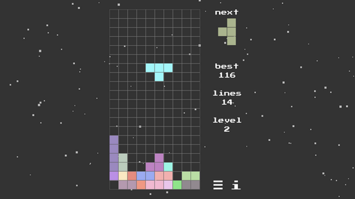
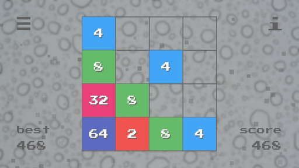
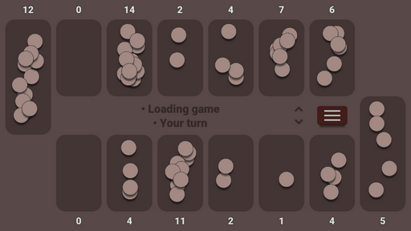
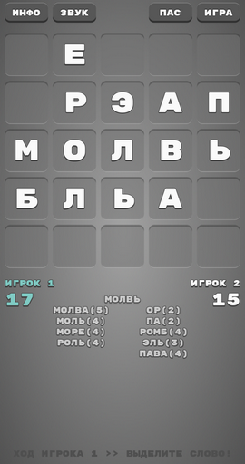
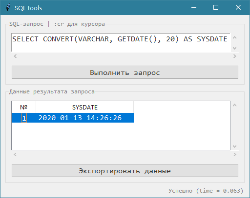

# Anton Bezdolny

`🤘 Hello World 🤘`

## Projects

### TETRIS 🎮

Collect as many lines of tetramino shapes as possible until the playing field is full.

*Соберите как можно больше линий из фигурок тетрамино, пока игровое поле не переполнилось.*

Download:
* [Windows](https://github.com/avbezdolny/pygame_tetris/releases/download/v1.0/pygame_tetris.exe)
* [GitHub >> pygame_tetris](https://github.com/avbezdolny/pygame_tetris)

### GAME 2048 🎮

Swipe to move the tiles. When two tiles with the same number touch, they merge into one. Join the numbers and get to the 2048 tile or more!

*Смахивайте плитки жестами по экрану для их движения. Когда две плитки с одинаковыми номерами касаются друг друга, они складываются в одну. Объедините числа и получите плитку 2048 или еще большую!*

Based by Gabriele Cirulli [original game](https://play2048.co) :)

Download:
* [Android](https://github.com/avbezdolny/game2048_kivy/releases/download/v2.2/game2048-2.2-armeabi-v7a.apk)
* [Windows](https://github.com/avbezdolny/game2048_kivy/releases/download/v2.2/game2048.exe)
* [GitHub >> game2048_kivy](https://github.com/avbezdolny/game2048_kivy)

### MANCALA 🎮

Mancala is an ancient family of board games. This version is known as two-rank Mancala and also known as Kalah (Bantumi)!

*Манкала относится к древнему семейству настольных игр. Данная версия известна как двухрядная Манкала или Калах (Бантуми)!*

Download:
* [Android](https://github.com/avbezdolny/mancala_kivy/releases/download/v2.2/mancala-2.2-armeabi-v7a.apk)
* [Windows](https://github.com/avbezdolny/mancala_kivy/releases/download/v2.2/mancala.exe)
* [GitHub >> mancala_kivy](https://github.com/avbezdolny/mancala_kivy)

### БУКВА 🎮

Лингвистическая настольная игра для двух игроков (также известная как "Балда" или "Слова"), в которой необходимо составлять слова с помощью букв, добавляемых определённым образом на квадратное игровое поле (5 x 5)!

Download:
* [Android](https://github.com/avbezdolny/bukva_kivy/releases/download/v2.2/bukva-2.2-armeabi-v7a.apk)
* [Windows](https://github.com/avbezdolny/bukva_kivy/releases/download/v2.2/bukva.exe)
* [GitHub >> bukva_kivy](https://github.com/avbezdolny/bukva_kivy)

### Notebooks 📒

### SQL TOOLS 🚀

Удобный GUI для ввода SQL-запросов к базе данных (на примере Oracle и MS SQL Server) и экспорта данных в формате CSV, с использованием Tkinter, cx_Oracle и Pyodbc!

Download:
* [GitHub >> sql_tools_tk](https://github.com/avbezdolny/sql_tools_tk)
