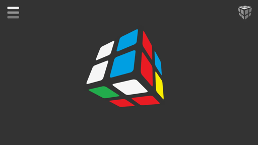

# Anton Bezdolny

`🤘 Hello World 🤘` [📧](mailto:softwareoutpost@gmail.com)

## Projects

### БУКВА 🎮

*Лингвистическая настольная игра для двух игроков (Балда) и одиночный режим головоломка-загадка (Wordle).*

  
[Политика конфиденциальности](bukva_privacy_policy.md)

### GAME 2048 + 15 🎮

Game 2048 and puzzle 15.

*Игра 2048 и головоломка 15 (пятнашки).*

  
[Privacy Policy](game2048_privacy_policy.md)

### BILLIARD 🎮

A classic board game with balls for two players according to simplified rules.

*Классическая настольная игра с шарами для двух игроков по упрощенным правилам.*

  
[Privacy Policy](billiard_privacy_policy.md)

### CUBE 🎮

When assembled, each side of the cube has its own color consisting of the color of the sides of its elements. At the beginning of the game, the cube is shuffled and the goal is to return the cube to its assembled state by rotating the elements.

*В собранном состоянии каждая сторона куба имеет свой цвет состоящий из цвета сторон его элементов. В начале игры куб перемешивается и цель в том, чтобы вращая элементы вернуть куб в собранное состояние.*

  
[Privacy Policy](cube_privacy_policy.md)

### MANCALA 🎮

Mancala is an ancient family of board games. This version is known as two-rank Mancala and also known as Kalah (Bantumi).

*Манкала относится к древнему семейству настольных игр. Данная версия известна как двухрядная Манкала или Калах (Бантуми).*

  
[Privacy Policy](mancala_privacy_policy.md)

### MINES 🎮

The goal of the game is to open all the cells on the field, except for the cells containing mines. The number in the open cell indicates the number of hidden mines in adjacent cells located horizontally, vertically, and diagonally. You can mark a cell with a flag if you think that it is mined. The cell with the flag is blocked from accidental clicking.

*Цель игры - открыть все ячейки на поле, кроме ячеек содержащих мины. Число в открытой ячейке означает количество скрытых мин в соседних ячейках расположенных по горизонтали, вертикали и диагонали. Можно пометить ячейку флагом, если считаете, что она заминирована. Ячейка с флагом заблокирована от случайного нажатия.*

  
[Privacy Policy](mines_privacy_policy.md)
