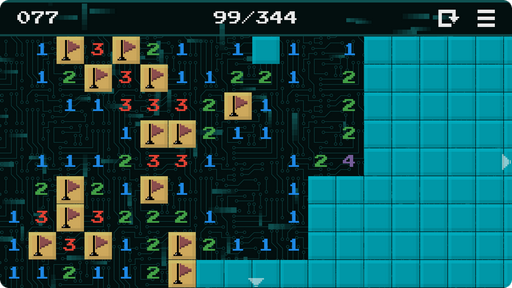

# Anton Bezdolny

`🤘 Hello World 🤘`

## Projects

### MANCALA 🎮

Mancala is an ancient family of board games. This version is known as two-rank Mancala and also known as Kalah (Bantumi).

*Манкала относится к древнему семейству настольных игр. Данная версия известна как двухрядная Манкала или Калах (Бантуми).*

Download:  
  
[Privacy Policy](mancala_privacy_policy.md)

### MINES 🎮

The goal of the game is to open all the cells on the field, except for the cells containing mines. The number in the open cell indicates the number of hidden mines in adjacent cells located horizontally, vertically, and diagonally. You can mark a cell with a flag if you think that it is mined. The cell with the flag is blocked from accidental clicking.

*Цель игры - открыть все ячейки на поле, кроме ячеек содержащих мины. Число в открытой ячейке означает количество скрытых мин в соседних ячейках расположенных по горизонтали, вертикали и диагонали. Можно пометить ячейку флагом, если считаете, что она заминирована. Ячейка с флагом заблокирована от случайного нажатия.*

Download:  

  
[Privacy Policy](mines_privacy_policy.md)
