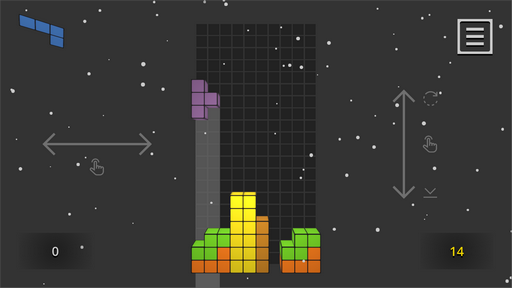

`🤘 Hello World 🤘` [📧](mailto:networkoutpost@gmail.com)

## \# Godot

### MINI-BILLIARD 🎮

A classic board game with balls for two players according to simplified rules.

*Классическая настольная игра с шарами для двух игроков по упрощенным правилам.*

Download:  
 
 

### TURTLE 🎮

Mahjong Solitaire is a board game for one person, similar in structure and gameplay to card solitaire, played with a set of chips of the Asian gambling game mahjong.

*Пасья́нс маджо́нг — настольная игра для одного человека, по структуре и игровому процессу похожа на карточный пасьянс, играется с помощью набора фишек азиатской азартной игры маджонг.*

Download:  
 
 

### TETRA-TOWER 🎮

Build the tallest tower out of tetramino figures or play in the classic line-building mode!

*Постройте самую высокую башню из фигурок тетрамино или играйте в классическом режиме построения линий!*

Download:  
 
 

## \# PyGame

### PYMINES 🎮

*Pymines (сапер) - очистите игровое поле!*

Download:  
 
 
 

### PYNCALA 🎮

*Pyncala (Манкала, Калах, Бантуми) из древнего семейства настольных игр :)*

Download:  
 
 
 

### XO 🎮

*Крестики-нолики нового поколения!*

Download:  
 
 
 

## \# Archive

### GAME 2048 + 15 🎮

Game 2048 and puzzle 15.

*Игра 2048 и головоломка 15 (пятнашки).*

Download:  
 
 

### БУКВА 🎮

*Лингвистическая настольная игра для двух игроков (Балда) и одиночный режим головоломка-загадка (Wordle).*

Download:  
 
 
