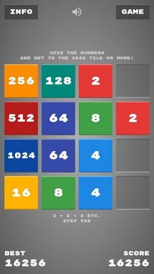
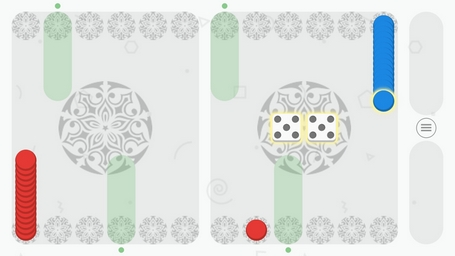

# Anton Bezdolny

`🤘 Hello World 🤘`

## Projects

### GAME 2048 ⭐

Swipe to move the tiles.
When two tiles with the same number touch, they merge into one.
Get to the 2048 tile and reach a high score!

Based by Gabriele Cirulli [original game](https://play2048.co) :)

Music by Eric Matyas from [soundimage.org](https://soundimage.org) :)

Download:
* [Android_arm_v7a](https://github.com/codeisrock/codeisrock.github.io/releases/download/Game2048-v1.1/Game2048.apk)
* [Android_arm64_v8a](https://github.com/codeisrock/codeisrock.github.io/releases/download/Game2048-v1.1/Game2048_arm64.apk)
* [Windows_x64](https://github.com/codeisrock/codeisrock.github.io/releases/download/Game2048-v1.1/Game2048_win_x64.7z)
* [Linux_x64](https://github.com/codeisrock/codeisrock.github.io/releases/download/Game2048-v1.1/Game_2048-x86_64.AppImage)

### NEW 🤘 Black Edition 🤘

Download:
* [Android_arm_v7a](https://github.com/codeisrock/codeisrock.github.io/releases/download/Game2048BE-v1.0/Game2048BE_arm_v7a.apk)
* [Android_arm64_v8a](https://github.com/codeisrock/codeisrock.github.io/releases/download/Game2048BE-v1.0/Game2048BE_arm64_v8a.apk)
* [Windows_x64](https://github.com/codeisrock/codeisrock.github.io/releases/download/Game2048BE-v1.0/Game2048BlackEdition_win_x64.7z)

### MANCALA ⭐

Mancala is an ancient family of board games. This version is known as two-rank Mancala and also known as Kalah (Bantumi). Your fields on the board are on the bottom side. Your store (kalah) is the big field on the right edge. Chose a field to pick up all seeds. Moving counter-clockwise, the game now deposits one of the seeds in each field until the seeds run out. If you run into your own store, deposit one seed in it. If you run into your opponent's store, skip it. If the last seed you drop is in your own store, you get a bonus turn. If the last seed you drop is in an empty field on your side, you capture that seed and any seeds in the field directly opposite. When playing with 72 seeds, the "rule of the pie" operates: after the first move in the game, the other player can rotate the board. The game ends when all six fields on one side of the board are empty. The player who still has seeds on his side of the board when the game ends captures all of those seeds. Count all the seeds in each store. The winner is the player with the most seeds.

Music by Eric Matyas from [soundimage.org](https://soundimage.org) :)

Download:
* [Android_arm_v7a](https://github.com/codeisrock/codeisrock.github.io/releases/download/Mancala-v1.1/Mancala.apk)
* [Android_arm64_v8a](https://github.com/codeisrock/codeisrock.github.io/releases/download/Mancala-v1.1/Mancala_arm64.apk)
* [Windows_x64](https://github.com/codeisrock/codeisrock.github.io/releases/download/Mancala-v1.1/Mancala_win_x64.7z)
* [Linux_x64](https://github.com/codeisrock/codeisrock.github.io/releases/download/Mancala-v1.1/Mancala-x86_64.AppImage)

### БУКВА ⭐

Лингвистическая настольная игра для 2 игроков, в которой необходимо составлять слова с помощью букв, добавляемых определённым образом на квадратное игровое поле. Слова составляются посредством переходов от буквы к букве под прямым углом. Игровое поле представляет собой 25-клеточную квадратную таблицу, клетки центральной строки которой содержат по одной букве, а строка целиком — произвольное 5-буквенное нарицательное имя существительное в именительном падеже и единственном числе (множественном числе, если слово не имеет единственного числа). Во время своего хода игрок может добавить букву в клетку, примыкающую по вертикали/горизонтали к заполненной клетке таким образом, чтобы получалась неразрывная и несамопересекающаяся прямоугольная ломаная («змейка») из клетки с добавленной буквой и других заполненных клеток, представляющая собой слово (соответствующее описанным выше требованиям), или пропустить ход (если оба игрока трижды подряд пропускают ход, то фиксируется ничья). Игра заканчивается тогда, когда либо заполнены все клетки, либо невозможно составить очередное слово согласно указанным выше правилам. Выигрывает тот игрок, который наберёт большее количество очков, кроме случая ничьи после троекратного пропуска хода обоими игроками.

Музыка от Frankun & Frankumjay с сайта [freesound.org](https://freesound.org) :)

Download:
* [Android_arm_v7a](https://github.com/codeisrock/codeisrock.github.io/releases/download/Bukva-v1.1/Bukva.apk)
* [Android_arm64_v8a](https://github.com/codeisrock/codeisrock.github.io/releases/download/Bukva-v1.1/Bukva_arm64.apk)
* [Windows_x64](https://github.com/codeisrock/codeisrock.github.io/releases/download/Bukva-v1.1/Bukva_win_x64.7z)
* [Linux_x64](https://github.com/codeisrock/codeisrock.github.io/releases/download/Bukva-v1.1/Bukva-x86_64.AppImage)

### LONG BACKGAMMON ⭐

Backgammon is one of the oldest games in the world. Distribution of the game began with the ancient East and now covered almost the whole world. In its essence, the game of backgammon is close to the dispute, and to science, and to art. Backgammon differs from most intellectual games in that each move in them depends not only on the situation on the Board, but also on the case, namely, the number of points dropped on the dice, which makes them the most democratic to the class of players.

Music by Elerya from [opengameart.org](https://opengameart.org/) :)

Download:
* [Android_arm_v7a](https://github.com/codeisrock/codeisrock.github.io/releases/download/Backgammon-v1.1/Backgammon.apk)
* [Android_arm64_v8a](https://github.com/codeisrock/codeisrock.github.io/releases/download/Backgammon-v1.1/Backgammon_arm64.apk)
* [Windows_x64](https://github.com/codeisrock/codeisrock.github.io/releases/download/Backgammon-v1.1/Backgammon_win_x64.7z)
* [Linux_x64](https://github.com/codeisrock/codeisrock.github.io/releases/download/Backgammon-v1.1/Long_Backgammon-x86_64.AppImage)

### SQL TOOLS 🚀

Удобный GUI для ввода SQL-запросов к базе данных (на примере Oracle и MS SQL Server) с использованием PySide2 + cx_Oracle или Pyodbc и экспорта данных в формате CSV!

Download:
* [GitHub](https://github.com/codeisrock/sql_tools)
