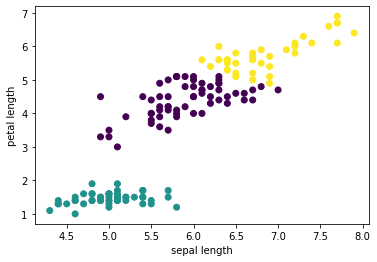

# Anton Bezdolny

`🤘 Hello World 🤘`

## Projects

### GAME 2048 🎮

Swipe to move the tiles. When two tiles with the same number touch, they merge into one. Join the numbers and get to the 2048 tile or more!

*Смахивайте плитки жестами по экрану для их движения. Когда две плитки с одинаковыми номерами касаются друг друга, они складываются в одну. Объединяйте числа и получите плитку 2048 или еще большую!*

Based by Gabriele Cirulli [original game](https://play2048.co) :)

Download:
* [Android Google Play](https://play.google.com/store/apps/details?id=avbezdolny.software.game2048)

### TETRIS 🎮

Collect as many lines of tetramino shapes as possible until the playing field is full.

*Соберите как можно больше линий из фигурок тетрамино, пока игровое поле не переполнилось.*

Download:
* [Android](https://github.com/avbezdolny/pygame_tetris/releases/download/v1.0.2/tetris.apk)
* [Windows](https://github.com/avbezdolny/pygame_tetris/releases/download/v1.0.1/pygame_tetris.exe)
* [GitHub >> pygame_tetris](https://github.com/avbezdolny/pygame_tetris)

### MINES 🎮

Open all cells without mines. No timers, no flags, pure puzzle.

*Откройте все ячейки без бомб. Никаких таймеров, никаких флагов, чистый пазл.*

Download:
* [Android](https://github.com/avbezdolny/pygame_mines/releases/download/v1.0.1/mines.apk)
* [Windows](https://github.com/avbezdolny/pygame_mines/releases/download/v1.0/pygame_mines.exe)
* [GitHub >> pygame_mines](https://github.com/avbezdolny/pygame_mines)

### NOTEBOOKS 📒

DS & ML

Download:
* [GitHub >> Кластеризация данных методом k-средних](https://github.com/avbezdolny/notebooks/blob/main/K-means.ipynb)
* [GitHub >> Линейная регрессия в Python](https://github.com/avbezdolny/notebooks/blob/main/LinearRegression.ipynb)

### SQL TOOLS 🚀

GUI на Python + Tkinter/PySide для SQL-запросов к базам данных, на примере MS SQL Server (pyodbc), Oracle (cx_Oracle) и SQLite (sqlite3)!

Download:
* [GitHub >> sql_tools](https://github.com/avbezdolny/sql_tools)
