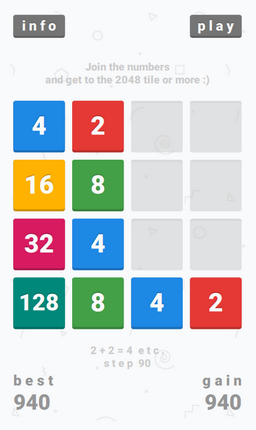
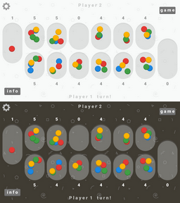
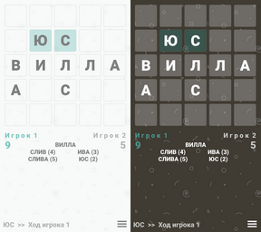

# Anton Bezdolny

`🤘 Hello World 🤘`

## Projects

### GAME 2048 ⭐

Swipe to move the tiles. When two tiles with the same number touch, they merge into one. Join the numbers and get to the 2048 tile or more!

*Смахивайте плитки жестами по экрану для их движения. Когда две плитки с одинаковыми номерами касаются друг друга, они складываются в одну. Объедините числа и получите плитку 2048 или еще большую!*

Based by Gabriele Cirulli [original game](https://play2048.co) :)

Music by Eric Matyas from [soundimage.org](https://soundimage.org) :)

Download:
* [Android_arm-v7a](https://github.com/codeisrock/codeisrock.github.io/releases/download/Game2048-v1.3/Game2048_arm7.apk)
* [Android_arm64-v8a](https://github.com/codeisrock/codeisrock.github.io/releases/download/Game2048-v1.3/Game2048_arm64-v8a.apk)
* [Windows_x64](https://github.com/codeisrock/codeisrock.github.io/releases/download/Game2048-v1.3/Game2048_win_x64.7z)
* [Linux_x64](https://github.com/codeisrock/codeisrock.github.io/releases/download/Game2048-v1.3/Game_2048-x86_64.AppImage)

### MANCALA ⭐

Mancala is an ancient family of board games. This version is known as two-rank Mancala and also known as Kalah (Bantumi)!

*Манкала относится к древнему семейству настольных игр. Данная версия известна как двухрядная Манкала или Калах (Бантуми)!*

Music by Eric Matyas from [soundimage.org](https://soundimage.org) :)

Download:
* [Android_arm-v7a](https://github.com/codeisrock/codeisrock.github.io/releases/download/Mancala-v1.3/Mancala_arm7.apk)
* [Android_arm64-v8a](https://github.com/codeisrock/codeisrock.github.io/releases/download/Mancala-v1.3/Mancala_arm64-v8a.apk)
* [Windows_x64](https://github.com/codeisrock/codeisrock.github.io/releases/download/Mancala-v1.3/Mancala_win_x64.7z)
* [Linux_x64](https://github.com/codeisrock/codeisrock.github.io/releases/download/Mancala-v1.3/Mancala-x86_64.AppImage)

### БУКВА ⭐

Лингвистическая настольная игра для двух игроков (также известная как "Балда" или "Слова"), в которой необходимо составлять слова с помощью букв, добавляемых определённым образом на квадратное игровое поле (5 x 5)!

Музыка от Frankun & Frankumjay с сайта [freesound.org](https://freesound.org) :)

Download:
* [Android_arm-v7a](https://github.com/codeisrock/codeisrock.github.io/releases/download/Bukva-v1.3/Bukva_arm7.apk)
* [Android_arm64-v8a](https://github.com/codeisrock/codeisrock.github.io/releases/download/Bukva-v1.3/Bukva_arm64-v8a.apk)
* [Windows_x64](https://github.com/codeisrock/codeisrock.github.io/releases/download/Bukva-v1.3/Bukva_win_x64.7z)
* [Linux_x64](https://github.com/codeisrock/codeisrock.github.io/releases/download/Bukva-v1.3/Bukva-x86_64.AppImage)

### LONG BACKGAMMON ⭐

Backgammon is one of the oldest games in the world. Backgammon differs from most intellectual games in that each move in them depends not only on the situation on the Board, but also on the case, namely, the number of points dropped on the dice, which makes them the most democratic to the class of players!

*Игра в нарды является одной из древнейших игр в мире. От большинства интеллектуальных игр нарды отличаются тем, что каждый ход в них зависит не только от ситуации на доске, но и от случая, а именно, от числа очков, выпавших на костях, что делает их наиболее демократичными к классу игроков!*

Music by Elerya from [opengameart.org](https://opengameart.org/) :)

Download:
* [Android_arm-v7a](https://github.com/codeisrock/codeisrock.github.io/releases/download/Backgammon-v1.3/Backgammon_arm7.apk)
* [Android_arm64-v8a](https://github.com/codeisrock/codeisrock.github.io/releases/download/Backgammon-v1.3/Backgammon_arm64-v8a.apk)
* [Windows_x64](https://github.com/codeisrock/codeisrock.github.io/releases/download/Backgammon-v1.3/Backgammon_win_x64.7z)
* [Linux_x64](https://github.com/codeisrock/codeisrock.github.io/releases/download/Backgammon-v1.3/Long_Backgammon-x86_64.AppImage)

### SQL TOOLS 🚀

Удобный GUI для ввода SQL-запросов к базе данных (на примере Oracle и MS SQL Server) и экспорта данных в формате CSV,  
с использованием PySide2, cx_Oracle и Pyodbc!

Download:
* [GitHub](https://github.com/codeisrock/sql_tools)
