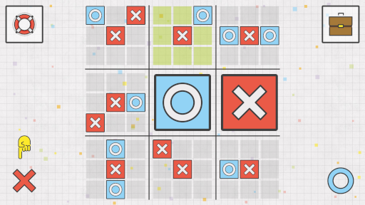
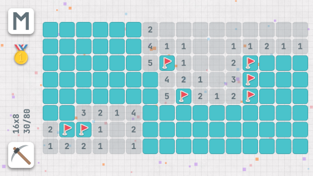
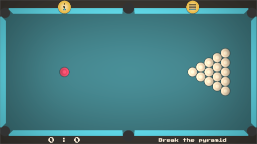
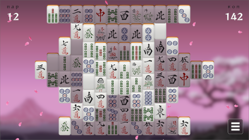
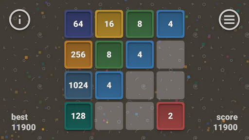
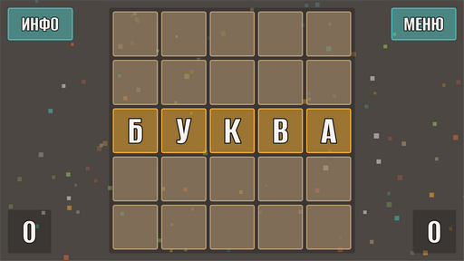
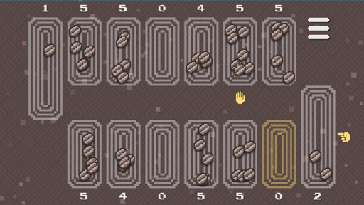
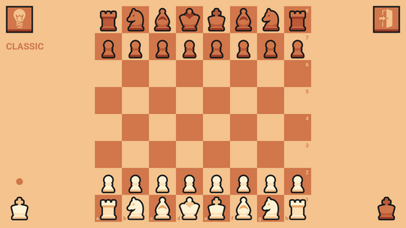

`🤘 Hello World 🤘`

*Приложения также доступны в [RuStore](https://www.rustore.ru/catalog/developer/02481566), приятной игры ❤*  
*Если хотите оказать поддержку или поделиться идеями и замечаниями, напишите мне [📧](mailto:networkoutpost@gmail.com)*

## \# Love2D ❤🌓

### TIC-TAC-TOE ❌⭕

Tic-tac-toe of the new generation!

*Крестики-нолики нового поколения!*

Download:  
 
 

### MINES (МИНЫ) 💣

Find all the mines on the playing field using the number hints!

*Найди все мины на игровом поле, используя числовые подсказки!*

Download:  
 
 

## \# Godot 🎮

### BILLIARD (БИЛЬЯРД) 🎱

A classic board game with balls for two players according to simplified rules.

*Классическая настольная игра с шарами для двух игроков по упрощенным правилам.*

Download:  
 

### MAHJONG TURTLE (МАДЖОНГ ЧЕРЕПАХА) 🀄

Mahjong Solitaire is a board game for one person, similar in structure and gameplay to card solitaire, played with a set of chips of the Asian gambling game mahjong.

*Пасья́нс маджо́нг — настольная игра для одного человека, по структуре и игровому процессу похожа на карточный пасьянс, играется с помощью набора фишек азиатской азартной игры маджонг.*

Download:  
 

### GAME 2️⃣0️⃣4️⃣8️⃣

Classic puzzle 2048 + 15 (tag)!

*Классическая головоломка 2048 + 15 (пятнашки)!*

Download:  
 

### БУКВА 🧩

*Лингвистическая настольная игра!*

Download:  
 

## \# PyGame 🐍

### PYNCALA (МАНКАЛА) 🌱

*Pyncala (Манкала, Калах, Бантуми) из древнего семейства настольных игр.*

Download:  
 
 

### ZENCHESS ☯♟

Шахматы навсегда с любовью ❤!

Download:  
 
 
